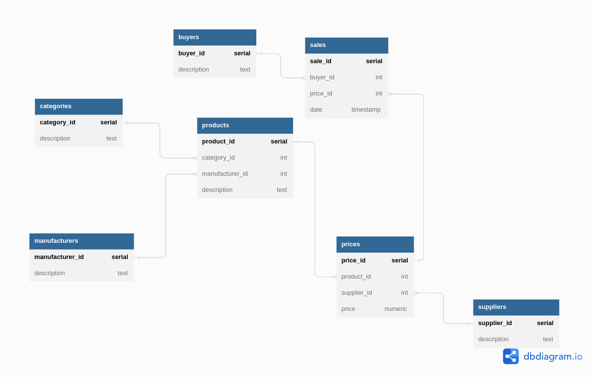

# **Лекция №1: Проектирование БД**
> _Проектирование БД_

## **Задание:**
Разработка проекта

Цель:
Спроектировать свою первую базу данных на курсе

Описание/Пошаговая инструкция выполнения домашнего задания:
Реализуйте сущности продукты, категории продуктов, цены, поставщики, производители, покупатели и покупки .
Свои решения для этой схемы приветствуются
В проекте должны быть

- схема
- описание таблиц и полей
- примеры бизнес-задач которые решает база
- ДЗ автоматически засчитывается при защите проекта на последнем занятии модуля

Критерии оценки:
10 - реализованы сущности и схема
плюс 2 балла за очень интересный проект
минус 2 балла, если работа выполнена, но имеются недостатки и студент не хочет их устранят

## Задание из презентации:
Начинаем готовить дипломный проект. По умолчанию “Интернет-магазин”
Реализуйте сущности продукты, категории продуктов, цены, поставщики, производители,
покупатели и покупки. Свои решения для этой схемы приветствуются
В проекте должны быть
- схема
- описание таблиц и полей
- примеры бизнес-задач которые решает база
  Сдача дз в виде ссылки на гитхаб с описанием проекта в markdown и схемой данных
  Пример: https://github.com/aeuge/Postgres14book
  ДЗ автоматически засчитывается при защите проекта на последнем занятии модуля
  10 - реализованы сущности и схема
  плюс 2 балла за очень интересный проект
  минус 2 балла, если работа выполнена, но имеются недостатки и студент не хочет их устранять

---

## **Выполнено:**

Реализуемые сущности (таблицы):
- Продукты (products) 
- Категории продуктов (categories)
- Цены (prices)
- Поставщики (suppliers)
- Производители (manufacturers)
- Покупатели (buyers)
- Покупки (sales)

Описание таблиц и полей

~~~roomsql
CREATE TABLE "categories" (
  "category_id" SERIAL PRIMARY KEY,
  "description" text NOT NULL
);

CREATE TABLE "manufacturers" (
  "manufacturer_id" SERIAL PRIMARY KEY,
  "description" text NOT NULL
);

CREATE TABLE "products" (
  "product_id" SERIAL PRIMARY KEY,
  "category_id" int NOT NULL,
  "manufacturer_id" int NOT NULL,
  "description" text NOT NULL
);

CREATE TABLE "suppliers" (
  "supplier_id" SERIAL PRIMARY KEY,
  "description" text NOT NULL
);

CREATE TABLE "prices" (
  "price_id" SERIAL PRIMARY KEY,
  "product_id" int NOT NULL,
  "supplier_id" int NOT NULL,
  "price" numeric DEFAULT 0
);

CREATE TABLE "buyers" (
  "buyer_id" SERIAL PRIMARY KEY,
  "description" text NOT NULL
);

CREATE TABLE "sales" (
  "sale_id" SERIAL PRIMARY KEY,
  "buyer_id" int NOT NULL,
  "price_id" int NOT NULL,
  "date" timestamp NOT NULL
);

ALTER TABLE "products" ADD FOREIGN KEY ("category_id") REFERENCES "categories" ("category_id");

ALTER TABLE "products" ADD FOREIGN KEY ("manufacturer_id") REFERENCES "manufacturers" ("manufacturer_id");

ALTER TABLE "prices" ADD FOREIGN KEY ("product_id") REFERENCES "products" ("product_id");

ALTER TABLE "prices" ADD FOREIGN KEY ("supplier_id") REFERENCES "suppliers" ("supplier_id");

ALTER TABLE "sales" ADD FOREIGN KEY ("buyer_id") REFERENCES "buyers" ("buyer_id");

ALTER TABLE "sales" ADD FOREIGN KEY ("price_id") REFERENCES "prices" ("price_id");
~~~

# **Полезное:**

